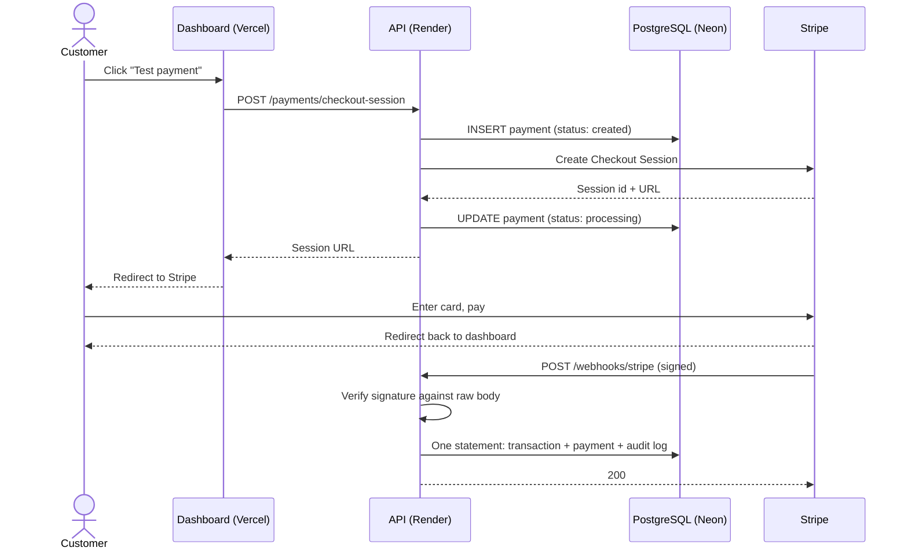

# How This Platform Works

A complete walkthrough: what it does, what it's built from, why each piece was chosen,
and who software like this is for. Written to be readable start to finish by someone who
did not build it.

---

## 1. What the platform does

It takes a card payment and keeps an accurate, auditable record of what happened to it.

That sounds small. The payment itself is the easy part — Stripe does that. The engineering
is in everything around it: knowing with certainty whether the money moved, recording it
exactly once, never trusting an unverified message, and being able to reconstruct the
sequence of events afterwards.

Three things you can see working at the live URL:

1. **A dashboard** showing gross volume, success rate, pending settlement, recorded events,
   a twelve-day volume chart, platform health, and the most recent transactions
2. **A payment button** that opens a real Stripe checkout page
3. **A ledger** that updates itself when Stripe confirms the payment

Everything on the dashboard is computed from the database. There are no hardcoded figures.

---

## 2. The pieces, and why each one

### The application

| Piece | Technology | Why this one |
| --- | --- | --- |
| Dashboard | **Next.js 16 / React 19** | Server-rendered, so the browser never holds an API URL or key. Also the framework both target jobs name. |
| API | **Fastify 5** | Fast, and its JSON-schema response validation means the API cannot accidentally return a shape it didn't promise. |
| Language | **TypeScript** (strict) | `strict`, `noUncheckedIndexedAccess` and `exactOptionalPropertyTypes` make the compiler a gate, not a formatter. |
| Database | **PostgreSQL 18** | Financial records need constraints, transactions and exact numeric types. The idempotency guarantee is enforced *by* the database. |
| Payments | **Stripe** | The industry standard, and hosted Checkout keeps card data entirely out of this system. |
| Queries | **Hand-written SQL** (`pg`) | No ORM. The interesting logic is in the SQL, and it should be readable as SQL. |

### The services it runs on

| Service | What it hosts | Why | Cost |
| --- | --- | --- | --- |
| **Vercel** | The dashboard | Built by the Next.js team; deploys straight from GitHub | Free |
| **Render** | The API | Deploys from a `render.yaml` file in the repo; free tier | Free |
| **Neon** | PostgreSQL | Serverless Postgres, permanent free tier, no card required | Free |
| **GitHub** | Code, CI, scheduled jobs | Actions runs the whole test suite on every push | Free |
| **Stripe** | Payments (test mode) | Sandbox behaves identically to production; no real money exists | Free |

All three hosting services sit in **Singapore**. That is deliberate: a page load travels
viewer → Vercel → Render → Neon, so if those are spread across continents every single load
pays three intercontinental round-trips. Colocated, the database answers in about 3ms.

---

## 3. What happens when someone pays

Read step by step:

1. **The click** goes to the dashboard's own server, not to Stripe and not to the API
   directly. The browser never learns the API's address.
2. **A payment row is created first**, before Stripe is contacted. If Stripe then fails, we
   still have a record that an attempt happened, marked `failed`.
3. **The Stripe session is created with the payment id as an idempotency key.** If the
   request is retried, Stripe returns the same session instead of opening a second one.
4. **The customer pays on Stripe's page**, on Stripe's domain. Card details never touch this
   platform. That single choice is what keeps the compliance burden small.
5. **Stripe sends a webhook** — a signed message saying what happened. This is the only thing
   we trust to mark a payment successful. A user returning to the success page proves
   nothing; they could have typed that URL.
6. **The signature is verified** against the raw, unparsed request body. Parsing first would
   change the bytes and break verification, which is why the webhook route opts into raw-body
   handling and no other route does.
7. **One SQL statement** records the event, updates the payment, and writes an audit entry —
   all or nothing.

---

## 4. The two ideas worth understanding

If you remember nothing else from this document, remember these.

### Idempotency lives in the database

Stripe delivers webhooks **at least once**. Retries follow any non-2xx response, and
duplicates happen anyway. A duplicated delivery must never produce a duplicated financial
record.

The obvious approach — check whether we've seen this event, then write — is wrong. Under
concurrent delivery both copies check, both find nothing, both write.

So the rule lives in the schema instead. `transactions.provider_event_id` carries a `UNIQUE`
constraint, and the insert says `ON CONFLICT DO NOTHING`. The payment update and audit write
are chained to that insert's result, so a duplicate event updates nothing at all.

This holds under concurrency, across restarts, and across any number of running servers —
because it is a property of a unique index, not of application logic that someone might
later edit.

### Payments and transactions are different things

- **`payments`** is mutable state: *where does this stand right now?*
- **`transactions`** is an append-only log: *what happened, and when did we learn it?*

Collapsing them into one table would make it impossible to reconstruct the current status
after a late or out-of-order delivery. Keeping them apart is what makes the ledger auditable.

---

## 5. How it's tested

Three layers, each catching what the layer beneath structurally cannot. Full detail in
[QUALITY_STRATEGY.md](QUALITY_STRATEGY.md).

| Layer | Count | Runs against | Catches |
| --- | --- | --- | --- |
| Unit | 19 | Stubbed database and Stripe | Branching, status mapping, guard clauses |
| Integration | 7 | Real PostgreSQL | SQL validity, constraints, idempotency |
| End-to-end | 5 | Built servers in a real browser | Rendering, hydration, the reviewer's path |
| Production smoke | 9 | The live deployment | That what shipped actually works |

**The story worth telling:** the webhook handler once had nineteen passing unit tests and had
never worked. `JSONB_BUILD_OBJECT` accepts `"any"`, so an uncast bind parameter had no
inferable type and PostgreSQL rejected the whole statement with `42P18`. Every real webhook
would have returned 500. No unit test could see it, because all of them stub the database.
The first integration test written against real PostgreSQL found it immediately.

The lesson is not "write more tests." A test suite has a *shape*, and defects collect where
that shape does not reach.

---

## 6. How code reaches production

1. Commit to a branch, open a pull request
2. **GitHub Actions** runs three jobs: API typecheck + unit + integration against a real
   PostgreSQL service; web lint + typecheck + build; end-to-end against migrated, seeded data
3. Merge to `main`
4. **Vercel** rebuilds the dashboard automatically; **Render** rebuilds the API automatically
5. Render runs database migrations **before** the new server accepts traffic
6. `node scripts/production-smoke.mjs` confirms the live system from outside

A change reaches the live site in well under a minute after merge.

---

## 7. Who uses software like this

This is a prototype, but the shape is the real shape. Businesses that need exactly this:

**Marketplaces and platforms** — anywhere money moves between a buyer and a seller and the
platform must keep its own record rather than relying on the processor's dashboard.

**Subscription and SaaS businesses** — the same lifecycle, with recurring events. The
payments/transactions split matters even more when a subscription changes state repeatedly.

**Payment gateways and processors** themselves — companies like KOMOJU exist to give
merchants this infrastructure. Their engineers spend their days on webhook reliability,
idempotency, and reconciliation.

**Fintech products** — lending, investment, fractional ownership, remittance. Anything where
a regulator or an auditor may later ask "what happened, and how do you know?"

**Any business with an internal finance team** — the operations dashboard here is the
recognisable shape of an internal admin tool: what came in, what's pending, what failed,
is the system healthy.

The common thread is not "accepting payments." It's **being able to prove afterwards what
happened**. That is the actual product.

---

## 8. Honest limits

- It runs in **Stripe test mode**. No real money can move, by design.
- It has **no users** and is not a commercial product.
- **Sign-in and the admin view are not built** — they're on the roadmap. The payment path was
  finished properly first, on the view that one complete thing beats three partial ones.
- The free hosting tier **sleeps when idle**; a scheduled job pings it every ten minutes to
  keep the demo responsive.
- Metrics are scoped to a **single currency**, because summing across currencies is
  meaningless and pretending otherwise would be worse than the limitation.

Being precise about what it does not do is part of what makes the rest credible.

---

## 9. Where to look in the code

| To understand | Read |
| --- | --- |
| The payment and webhook logic | `apps/api/src/payments/payments.routes.ts` |
| The metric aggregation SQL | `apps/api/src/metrics/metrics.routes.ts` |
| The schema and its constraints | `database/postgres/migrations/001_initial_schema.sql` |
| The idempotency proof | `apps/api/src/database/ledger.integration-test.ts` |
| The reviewer's path | `apps/web/e2e/dashboard.spec.ts` |
| The deployment definition | `render.yaml` and `.github/workflows/ci.yml` |
| Why each decision was made | `docs/decisions/` |
