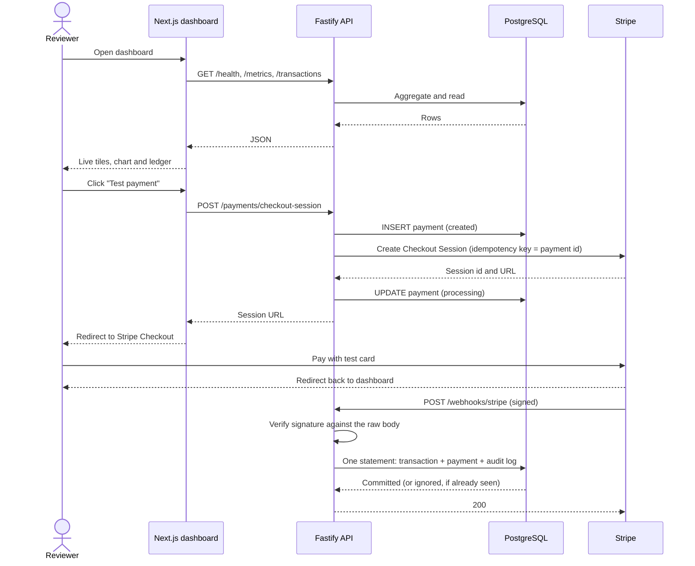

# System Overview

ZEROFAYYZ FINTECH is a cloud payments and operations platform running against the Stripe
sandbox. This page describes how a payment travels through it and why the pieces are
arranged the way they are.

## Request flow

The browser never talks to the API directly. The dashboard reads it server-side and proxies
the checkout call through a Next.js route, so the API stays on a private network in
deployment and no API URL or key reaches the client.

## Components

| Piece | Location | Responsibility |
| --- | --- | --- |
| Dashboard | `apps/web` | Server-rendered operations view; proxies checkout and the admin API |
| Vue client | `apps/web-vue` | Vue 3 + Pinia SPA on the same API, with its own operator area |
| Svelte client | `apps/web-svelte` | SvelteKit (static adapter) on the same API, data via `load` |
| Shared contract | `packages/api-contract` | One Zod description of every response, validated by all three clients |
| API | `apps/api` | Health, readiness, metrics, ledger reads, checkout, webhooks, auth, admin |
| Reconciler | `services/reconciler` | **Go.** Re-derives payment state from the event log and disagrees with the payments table when they diverge |
| Database | `database/postgres` | Users, payments, transactions, audit logs, sessions, refund requests |
| Migrations | `apps/api/src/database/migrate.ts` | Ordered, recorded, transactional |
| Container | `apps/api/Dockerfile` | Multi-stage, non-root, health-checked against `/ready` |
| Orchestration | `infrastructure/kubernetes` | Applied manifests; probes split across `/ready` and `/health` |
| Pipeline | `.github/workflows/ci.yml` | Ten jobs: API, container, reconciler, three clients, MCP, BDD, visual, end-to-end |
| Monitoring | `.github/workflows/production-watch.yml` | Hourly smoke against production; a failed run is an email |

## Data model

Five tables, each with one job.

- **users** — a customer. Unique on `LOWER(email)` so casing cannot create duplicates.
- **payments** — the intent to move money, and its current status. One row per attempt.
- **transactions** — the immutable event log. One row per Stripe event, unique on
  `provider_event_id`.
- **sessions** — one row per live sign-in. Stores the SHA-256 of the cookie value, never the
  value itself, so a dump grants no one a session. Expiry and revocation are evaluated in
  SQL, and the presence view reads the same predicate the door does.
- **audit_logs** — what the system did and when, for anything that changed state.
  Append-only, enforced by a trigger that refuses `UPDATE` and `DELETE` from every
  connection including the application's own. It carries **no foreign keys**: a reference
  with an `ON DELETE` action is a write into this table performed on another table's
  behalf, which the trigger refuses — so ids are stored as plain values and read back with
  `LEFT JOIN`.

The split between `payments` and `transactions` is the important one. A payment is mutable
state that answers "where does this stand now." A transaction is an append-only fact that
answers "what happened, and when did we learn it." Collapsing them into one table would make
the current status impossible to reconstruct after a late or out-of-order delivery.

## Status model

A payment moves `created → processing → succeeded | failed | canceled`. Only the webhook
promotes a payment past `processing`; the checkout endpoint never marks anything successful,
because the only trustworthy confirmation is a signed event from Stripe.

## Failure behaviour

The platform is built to degrade visibly rather than pretend.

- No Stripe key configured: checkout returns `503` and the dashboard tile reads
  "Awaiting test key" instead of showing a broken button
- No signing secret: the webhook returns `503` rather than accepting unverified events
- Database unreachable: `/health` reports `degraded`, and the dashboard renders "Unavailable"
  tiles rather than blank ones
- Stripe rejects the session: the payment is marked `failed` before the error is returned,
  so no payment row is left stranded in `created`
- The audit log cannot be written: privileged actions (a forced sign-out) fail rather than
  proceed unrecorded, while sign-ins proceed and log the failure loudly — refusing a valid
  login over a bookkeeping error trades a logging problem for an outage
- The API is unreachable when the dashboard renders: the signed-out state is shown rather
  than a 500, so the private half can never take the public half down

## Operational surface

Two health endpoints, deliberately answering different questions. Conflating them is how a
deploy passes its check and then serves 500s.

| Endpoint | Question | When the database is unreachable |
| --- | --- | --- |
| `/api/v1/health` | Is this process alive and what does it know? | **200**, `status: degraded` — a process that can describe its own degradation is worth inspecting, not killing |
| `/api/v1/ready` | May traffic come here? | **503** — the instance leaves the load balancer's pool rather than accepting payments it cannot record |

Demonstrated rather than asserted: removing the database from a running Kubernetes
deployment took both pods out of the Service's endpoints with `restarts=0`, and restoring
it returned them with no intervention. Transcript in
[KUBERNETES.md](../runbooks/KUBERNETES.md).

Every log line is JSON carrying a request id, and the same id is returned to the caller in
`x-request-id`. An upstream id is honoured so a trace beginning at a proxy survives — but
validated first, because that value is echoed into a response header and written into logs.

Every response on every origin carries security headers. The API, serving only JSON to
programs, can afford the strictest set: `default-src 'none'; frame-ancestors 'none'`,
`nosniff`, `DENY`, `no-referrer`, HSTS, and `cross-origin-resource-policy: same-origin`.

## Independent verification

The ledger is checked by something that does not share its code.

`services/reconciler` is a Go program that reads the database directly, re-derives every
payment's status from the append-only `transactions` log, and exits non-zero when that
disagrees with the `payments` table. It is a separate process in a different language on
purpose: a checker built inside the API would inherit the API's model of a refund and
therefore agree with the API's bugs. It reads and never writes — something able to "fix" a
discrepancy is able to destroy the evidence of it.

The case that makes it non-trivial is partial refunds, which emit the same event type as
full ones. "A refund event exists, therefore refunded" would flag every partially refunded
payment, and a report with false positives is a report nobody opens.

## Related reading

- [Decision records](../decisions/) — why the significant choices were made
- [Quality strategy](../QUALITY_STRATEGY.md) — how the system is tested
- [Local development](../runbooks/LOCAL_DEVELOPMENT.md) — how to run it
- [Container](../runbooks/CONTAINER.md) — the image, and what it was verified to do
- [Kubernetes](../runbooks/KUBERNETES.md) — the manifests, and the failure mode they were tested against
- [Reconciler](../../services/reconciler/README.md) — why the ledger check is written in Go
- [ADR 17 — two row-level security models, side by side](../decisions/0017-two-row-level-security-models.md), and the [receipt portal](https://github.com/marcelgilbertdev-oss/receipt-portal) that exists to make the comparison real
