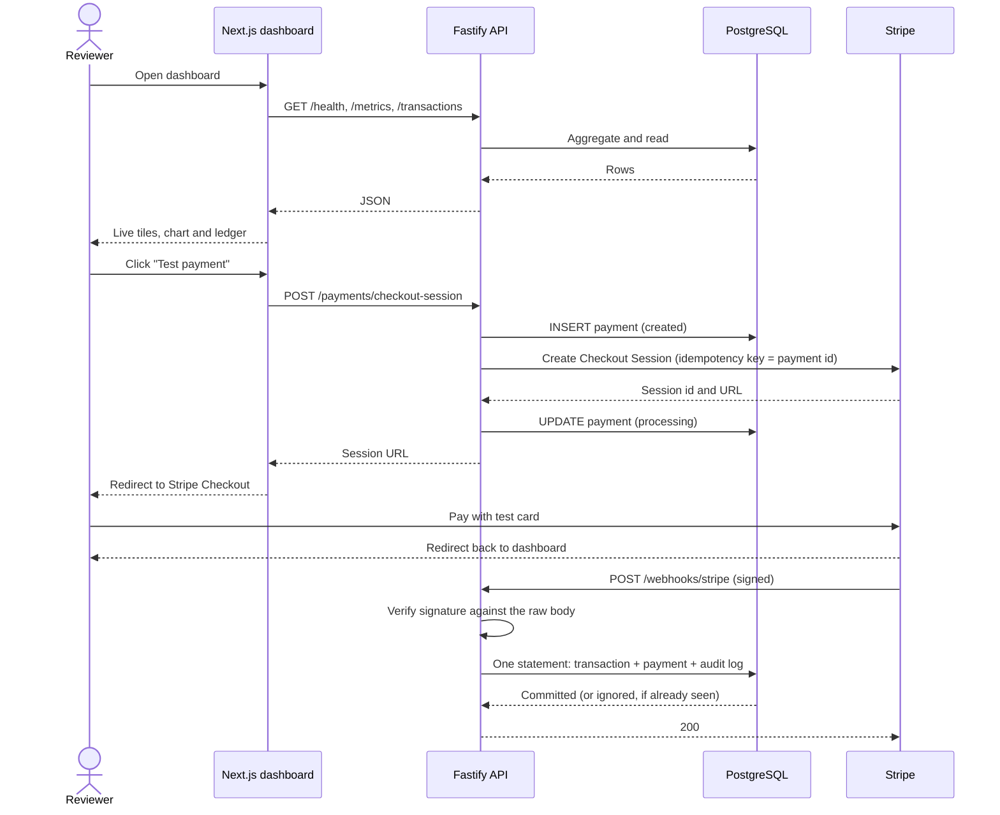

# System Overview

ZEROFAYYZ FINTECH is a cloud payments and operations platform running against the Stripe
sandbox. This page describes how a payment travels through it and why the pieces are
arranged the way they are.

## Request flow

The browser never talks to the API directly. The dashboard reads it server-side and proxies
the checkout call through a Next.js route, so the API stays on a private network in
deployment and no API URL or key reaches the client.

## Components

| Piece | Location | Responsibility |
| --- | --- | --- |
| Dashboard | `apps/web` | Server-rendered operations view; proxies checkout |
| API | `apps/api` | Health, metrics, transactions, checkout, webhooks |
| Database | `database/postgres` | Users, payments, transactions, audit logs |
| Migrations | `apps/api/src/database/migrate.ts` | Ordered, recorded, transactional |
| Pipeline | `.github/workflows/ci.yml` | Typecheck, lint, unit, integration, end-to-end |

## Data model

Four tables, each with one job.

- **users** — a customer. Unique on `LOWER(email)` so casing cannot create duplicates.
- **payments** — the intent to move money, and its current status. One row per attempt.
- **transactions** — the immutable event log. One row per Stripe event, unique on
  `provider_event_id`.
- **audit_logs** — what the system did and when, for anything that changed state.

The split between `payments` and `transactions` is the important one. A payment is mutable
state that answers "where does this stand now." A transaction is an append-only fact that
answers "what happened, and when did we learn it." Collapsing them into one table would make
the current status impossible to reconstruct after a late or out-of-order delivery.

## Status model

A payment moves `created → processing → succeeded | failed | canceled`. Only the webhook
promotes a payment past `processing`; the checkout endpoint never marks anything successful,
because the only trustworthy confirmation is a signed event from Stripe.

## Failure behaviour

The platform is built to degrade visibly rather than pretend.

- No Stripe key configured: checkout returns `503` and the dashboard tile reads
  "Awaiting test key" instead of showing a broken button
- No signing secret: the webhook returns `503` rather than accepting unverified events
- Database unreachable: `/health` reports `degraded`, and the dashboard renders "Unavailable"
  tiles rather than blank ones
- Stripe rejects the session: the payment is marked `failed` before the error is returned,
  so no payment row is left stranded in `created`

## Related reading

- [Decision records](../decisions/) — why the significant choices were made
- [Quality strategy](../QUALITY_STRATEGY.md) — how the system is tested
- [Local development](../runbooks/LOCAL_DEVELOPMENT.md) — how to run it
